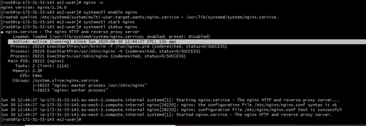
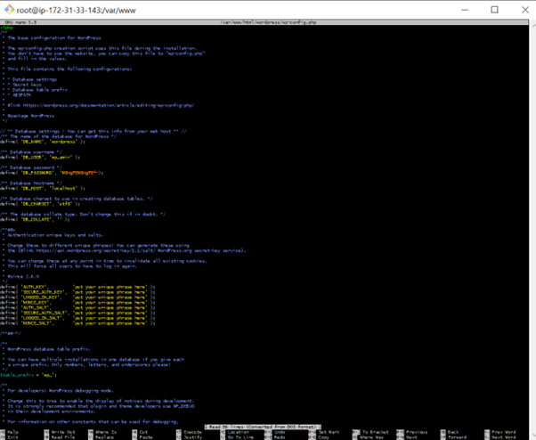
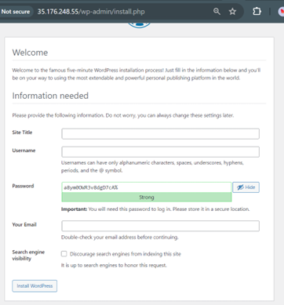

#  Setting up WordPress on a EC2 instance with Nginx and MariaDB

## Step 1: Create and Configure the VPC

    
<em>Figure 1: VPC - Created a VPC with a CIDR block of 10.0.0.0/16. CIDCR blocks is a way of defining a range of IP addresses it's like saying 1 to 100 are in this area.
    
    The VPC is your private section of the internet where you can run your servers sucurely and only your servers! 

### What does it do?

- It creates a virtual network dedicated to my AWS account with an address range (10.0.0.0/16)

---
## Step 2: Create a Subnet

    
<em>Figure 2: Subnet - Created a subnet with a CIDR block of 10.0.0.0/24 within the VPC. This is like saying, "My land includes all addresses from 10.0.0.0 to 10.0.0.0.256. This subnet can support up to 256 IP addresses, which includes network, broadcast, and host addresses. Number of available IP addresses is 2 to the power of 8 = 256 as the first 24 bits are in use and there are 32 bits in an IP address.
    
    A subnet is like dividing your office into rooms, organising and isolating different parts of your network!

### What does it do?

- It creates a smaller network within my VPC 10.0.0.0/24, allowing up to 256 IP addresses

---

## Step 3: Create an Internet Gateway

    
<em>Figure 3: IGW - Created a IG and attached IG to the VPC
    
    An Internet Gateway allows your servers to access the internet and lets people from the internet access your servers.

### What does it do?

- It creates and attaches an Internet Gateway to my VPC, enabling internet connectivity which is essential for web servers and other resources that need to communicate with the outside world.

---

## Step 4: Create a Route Table

    
<em>Figure 4: RTB - Created a route table for the VPC, then created  a route to the direct internet traffic to the Internet Gateway then associated the route table with the subnet.
    
    The route table determines how traffic is directed within the VPC. 

### What does it do?

- Associating the route table with the subnet ensures that traffic from the subnet is routed through the Internet Gateway, allowing instances in the subnet to access the internet.

---

## Step 5: Create EC2 Instance with Public IP

    
<em>Figure 5: EC2 Instance - Created an EC2 Instance with a Public IP in order to host Wordpress and be accessible from anywhere and to manage it remotely using SSH.
    
    The EC2 instance is the backbone of the web server setup as well other resources like application, database and file servers.

### What does it do?

- EC2 instance acts as your virtual server, providing the necessary compute power, storage, and network connectivity to host and run your resources, in this task, it is the web application Wordpress. 

---
---

## Step 6: Configuring Security Groups during EC2 setup

    
<em>Figure 6: During the EC2 set up, I created a security group and enabled auto-assign public IP as it needs to be accessible from the internet, allows you to SSH, to be able to host web application service, it needs to be accessible to users on the internet and it saves time and effort so you don't need to manually assign and manage IP addresses after creating the EC2. I also configured the inbound rules so that the port range is set to port 22 for SSH and source is my IP address so that only I can SSH to it and not somebody else.

    Inbound Rules: Decide what kind of incoming traffic is allowed to reach your instance (e.g., allowing web traffic on port 80 or SSH on port 22).
    
    Outbound Rules: Decide what kind of outgoing traffic is allowed to leave your instance (e.g., allowing the instance to access the internet).
    

### What does it do?

- Security groups act like virtual firewalls when you launch an EC2 instance. They control the incoming and outgoing traffic to and from your instance.

---

## Step 7: Connect to the EC2 Instance

    
<em>Figure 7: I ran the chmod command first to ensure my key is not publicly viewable.Then I ran the ssh command to securely access  my server and it opens a remote connection to my EC2 instance.

    The chmod 400 command sets the file permissions of the private key file (coderco-prod.pem) so that only the owner can read it

### What does it do?

- Uses SSH to open a remote connection to the EC2 instance.

---

## Step 8: Install Nginx

    
<em>Figure 8: I installed Nginx web server which is also a reverse proxy and it ensures efficient, secure and scalable delivery of web applications (Wordpress). In this screenshot, I am checking if it has installed and enlabing the service making sure it is running and listening on port 80. When running the curl localhost, I can confirm nginx web server was successfully installed.

    Installing Nginx is crucial for serving your WordPress site and other web applications

### What does it do? (brief)

- WB: Handles HTTP requests, delivering web content to visitors’ browsers.

- RP: Acts as an intermediary, improving load distribution and reducing server load.

- LB: Distributes incoming traffic across multiple servers, preventing any single server from becoming a bottleneck.

---
## Step 9: Install PHP MySQL

    
<em>Figure 9: I installed PHP and set up PHP environment to handle PHP scripts and connect to MariaDB database and setup the database server (Maria DB) where WordPress will store its data. I verified that it is installed as I can see mysqli/mysqlnd listed in the output

    Installing PHP MySQL (php8.3-mysqlnd) is essential for connecting and communicating with MariaDB databases. Since WordPress requires a database to store its data, this installation ensures that PHP can interact with the MariaDB database

### What does it do? (brief)

- PHP MySQL is a PHP extension that provides the functionality for PHP to communicate with MariaDB databases and MySQL databases.

## Step 10: Install MariaDB 10.5 on Amazon Linux using the default repo

    
<em>Figure 10: Here you can see the mariadb105 server and client, I done this by checking the Amazon linux repo by checking sudo yum search mariadb, sudo yum list available shows all the available packages so I want to narrow it down with a specific package. Then I've installed MariaDB 10.5 (Including server and client). Then I've started, enabled and checked the status which shows it is running.

    Installing MariaDB is essential to store, manage and retrieve data. As Wordpress relies on a database to store all its content, user data, settings, etc - MariaDB provides the infra to manage this data.

### What does it do? and why do we need PHP MySQL if we already have MariaDB that can manage the data? (a question I asked myself)

- MariaDB is the database server that stores, manages, and retrieves data. It handles all the data operations, such as creating, reading, updating, and deleting data in the database.

 - MariaDB handles the data storage and management

 - PHO MySQL enables PHP applications such as Wordpress to communicate with MariaDB, sending queries and receiving data.
 
 ---

 ## Step 12: Log in to MariaDB as the Root User and Create a Database and User for WordPress

    
<em>Figure 11: Logged in to MariaDB as the root user and created database and user for WordPress then I navigated to the web root directory, downloaded the latest version of WordPress, extracted the downloaded tar.gz file and moved the extracted WordPress files to the HTML directory. Then I copied the sample WordPress configuration file to create a new config file, then opened the WordPress config file in a text editor, this is the database settings in wp-config.php, the wp-config.php file contains the configuration details that WordPress uses to connect to the MariaDB database. Lastly, I've set the permissions where I've changed the ownership of all files and directories directories in /var/www/html/wordpress to the user 'nginx' and group 'nginx'
   

    WordPress needs a database to store all its data, including posts, pages, user information, and settings.

    For security reasons, it's best to create a specific database user for WordPress with limited permissions.

### What does it do?

Database - By creating a database specifically for WordPress, you organise your data and ensure that WordPress can manage its data separately from other applications.

User - This minimises security risks by restricting what the WordPress user can do within the database.

 
 Database Settings in wp-config.php - WordPress uses a configuration file to store database connection details and other settings. WordPress needs to know how to connect to your MariaDB database. 

Changing Ownership - The web server (Nginx) needs permission to read and write to the WordPress files. It ensures that the Nginx user owns the WP files, allowing the web server to manage them correctly.

Set Permissions - Proper file and directory permissions are crucial for security and functionality.It makes sure directories are executable and readable (755) and that files are readable (644), which is a common and secure configuration.

 ---

 ## Step 13: Nginx Configuration for WordPress and setting the EC2 Public IP address

    
<em>Figure 12: sudo nano /etc/nginx/conf.d/wordpress.conf - allowed me to configure and define how Nginx will handle incoming HTTP requests and serve the WP site. I was able to specify the server name which was my EC2 IP address which ensures Nginx listens for requests coming to my EC2 instance's public IP address.
    
    configured Nginx to serve my WordPress site using my EC2 instance's public IP address, making my WordPress site accessible at http://35.176.248.55.

### What is it?

/etc/nginx/conf.d/wordpress.conf: Specifies the path to the configuration file for Nginx. This file will contain the configuration settings for serving your WordPress site.

 ---

 ## Step 14: Completed the WordPress Installation

    
<em>Figure 12: Opened my web browser and navigate to http://35.176.248.55, followed the on-screen instructions to complete the WordPress installation,I needed to enter details such as the site title, admin username, password, and email address.

### What is it?

/etc/nginx/conf.d/wordpress.conf: Specifies the path to the configuration file for Nginx. This file will contain the configuration settings for serving your WordPress site.

 ---