# Setting up WordPress on an EC2 Instance with Nginx and MariaDB

## Step 1: Create and Configure the VPC

    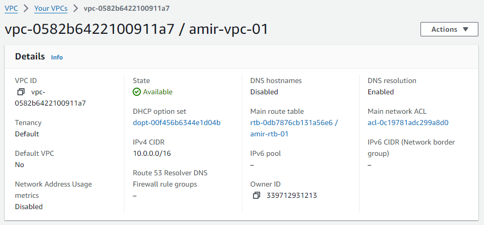
    
<em>Figure 1: VPC - Created a VPC with a CIDR block of 10.0.0.0/16. CIDR blocks define a range of IP addresses. The VPC is your private section of the internet where you can run your servers securely.</em>

### What does it do?

- Creates a virtual network dedicated to my AWS account with an address range of 10.0.0.0/16

---

## Step 2: Create a Subnet

    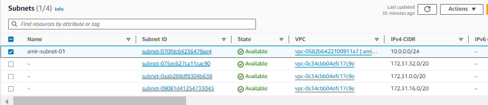
    
<em>Figure 2: Subnet - Created a subnet with a CIDR block of 10.0.0.0/24 within the VPC. This subnet can support up to 256 IP addresses, including network, broadcast, and host addresses.</em>

### What does it do?

- Creates a smaller network within my VPC (10.0.0.0/24), allowing up to 256 IP addresses.

---

## Step 3: Create an Internet Gateway

    
    
<em>Figure 3: IGW - Created an Internet Gateway and attached it to the VPC. An Internet Gateway allows your servers to access the internet and lets people from the internet access your servers.</em>

### What does it do?

- Creates and attaches an Internet Gateway to my VPC, enabling internet connectivity essential for web servers and other resources that need to communicate with the outside world.

---

## Step 4: Create a Route Table

    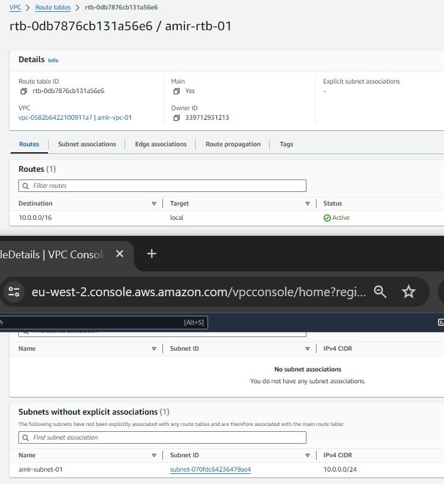
    
<em>Figure 4: RTB - Created a route table for the VPC, then created a route to direct internet traffic to the Internet Gateway and associated the route table with the subnet. The route table determines how traffic is directed within the VPC.</em>

### What does it do?

- Associating the route table with the subnet ensures that traffic from the subnet is routed through the Internet Gateway, allowing instances in the subnet to access the internet.

---

## Step 5: Create EC2 Instance with Public IP

    
    
<em>Figure 5: EC2 Instance - Created an EC2 Instance with a Public IP to host WordPress and be accessible from anywhere. This allows remote management using SSH. The EC2 instance is the backbone of the web server setup.</em>

### What does it do?

- Acts as your virtual server, providing the necessary compute power, storage, and network connectivity to host and run your resources, such as the web application WordPress.

---

## Step 6: Configuring Security Groups during EC2 Setup

    
    
<em>Figure 6: During the EC2 setup, created a security group, enabled auto-assign public IP, and configured inbound rules for port 22 for SSH access. Security groups act like virtual firewalls for your instance.</em>

### What does it do?

- Controls the incoming and outgoing traffic to and from your instance.

---

## Step 7: Connect to the EC2 Instance

    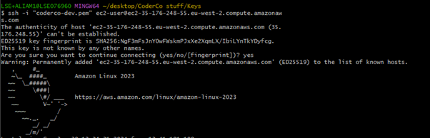
    
<em>Figure 7: Ran the chmod command to ensure my key is not publicly viewable, then ran the ssh command to securely access my server. The chmod 400 command sets the file permissions of the private key file (coderco-prod.pem) so that only the owner can read it.</em>

### What does it do?

- Uses SSH to open a remote connection to the EC2 instance.

---

## Step 8: Install Nginx

    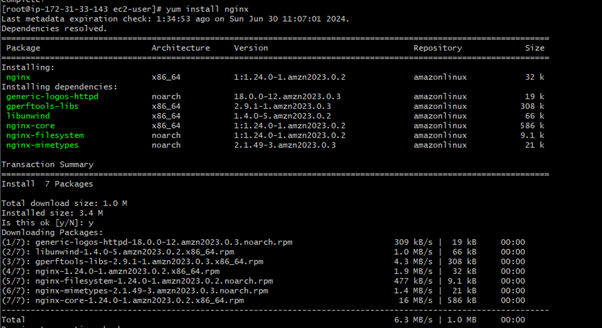
    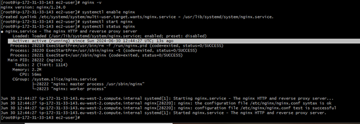
    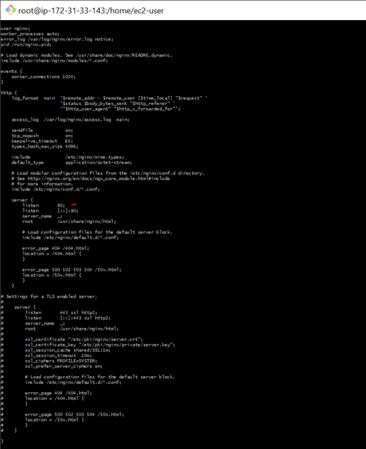
    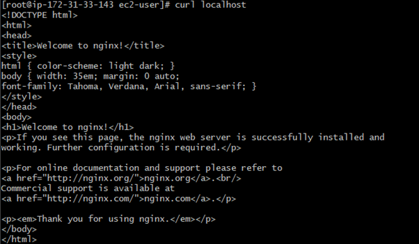
    
<em>Figure 8: Installed Nginx web server, checked if it was installed, enabled the service, and ensured it was running and listening on port 80. When running curl localhost, I confirmed the Nginx web server was successfully installed. Nginx ensures efficient, secure, and scalable delivery of web applications (WordPress).</em>

### What does it do?

- **Web Server**: Handles HTTP requests, delivering web content to visitors’ browsers.
- **Reverse Proxy**: Acts as an intermediary, improving load distribution and reducing server load.
- **Load Balancer**: Distributes incoming traffic across multiple servers, preventing any single server from becoming a bottleneck.

---

## Step 9: Install PHP MySQL

    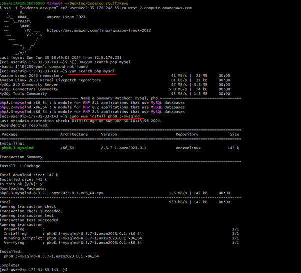
    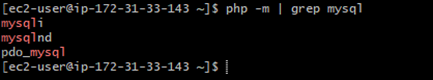
    
<em>Figure 9: Installed PHP and set up the PHP environment to handle PHP scripts and connect to the MariaDB database. Verified that it is installed as mysqli/mysqlnd listed in the output. Installing PHP MySQL is essential for connecting and communicating with MariaDB databases.</em>

### What does it do?

- PHP MySQL is a PHP extension that provides the functionality for PHP to communicate with MariaDB and MySQL databases.

---

## Step 10: Install MariaDB 10.5 on Amazon Linux using the Default Repo

    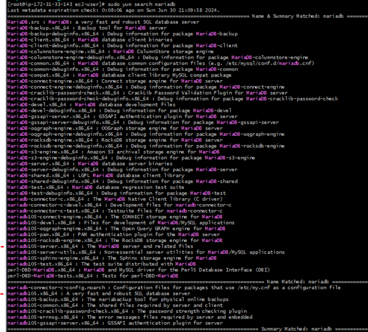
    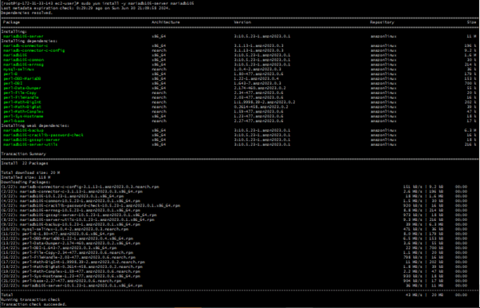
    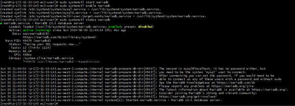
    
<em>Figure 10: Installed MariaDB 10.5 (including server and client), started, enabled, and checked the status to ensure it was running. MariaDB is essential for storing, managing, and retrieving data, as WordPress relies on a database to store its content, user data, settings, etc.</em>

### What does it do?

- MariaDB handles data storage and management.
- PHP MySQL enables PHP applications such as WordPress to communicate with MariaDB, sending queries and receiving data.

---

## Step 11: Log in to MariaDB as the Root User and Create a Database and User for WordPress

    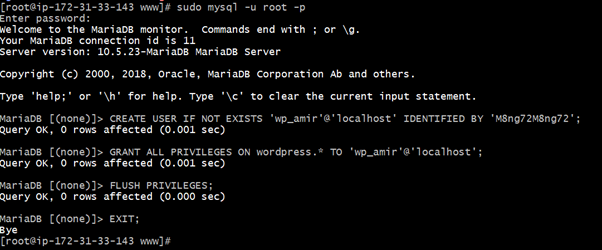
    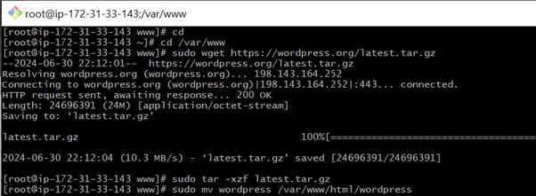
    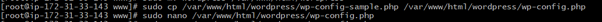
    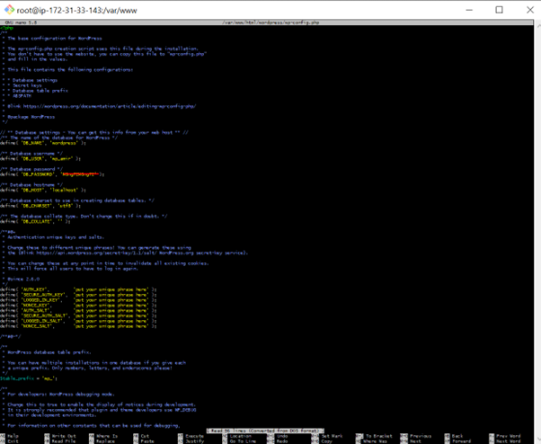
    
    
<em>Figure 11: Logged in to MariaDB as the root user, created a database and user for WordPress, navigated to the web root directory, downloaded the latest version of WordPress, extracted the downloaded tar.gz file, and moved the extracted WordPress files to the HTML directory. Configured WordPress by setting database settings in wp-config.php and changed the ownership of all files and directories to the user 'nginx' and group 'nginx'.</em>

### What does it do?

- **Database**: Organizes data, ensuring WordPress can manage its data separately from other applications.
- **User**: Restricts what the WordPress user can do within the database, minimizing security risks.
- **Database Settings**: WordPress uses wp-config.php to connect to the MariaDB database.
- **Changing Ownership**: Ensures that the Nginx user owns the WordPress files, allowing the web server to manage them correctly.
- **Set Permissions**: Ensures directories are executable and readable (755), and files are readable (644), a secure configuration.

---

## Step 12: Nginx Configuration for WordPress and Setting the EC2 Public IP Address

    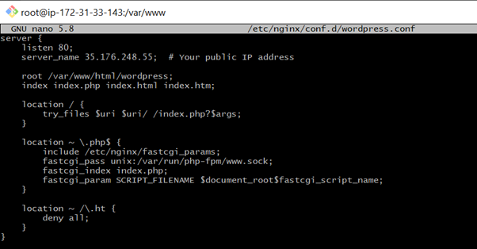
    
<em>Figure 12: Configured Nginx to serve my WordPress site using my EC2 instance's public IP address by editing /etc/nginx/conf.d/wordpress.conf. This configuration ensures Nginx listens for requests coming to my EC2 instance's public IP address.</em>

### What is it?

- **/etc/nginx/conf.d/wordpress.conf**: Specifies the configuration settings for serving your WordPress site.

---

## Step 13: Completed the WordPress Installation

    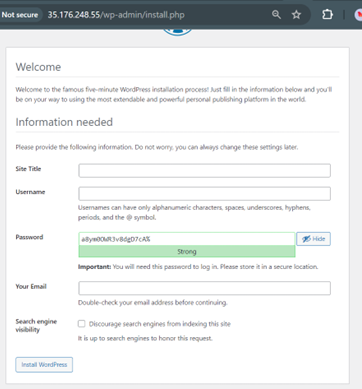
    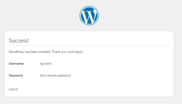
    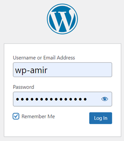
    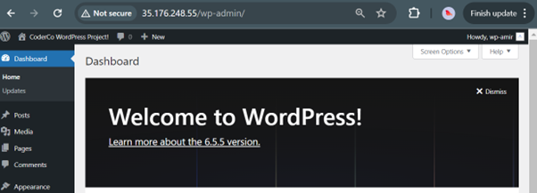
    
<em>Figure 13: Opened my web browser, navigated to http://35.176.248.55, and followed the on-screen instructions to complete the WordPress installation by entering details such as the site title, admin username, password, and email address. Successfully installed MariaDB, Nginx, PHP, and configured WordPress on my EC2 instance.</em>

