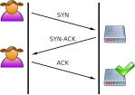

# Explanation of what happens you type 	[www.google.com](www.google.com) into a web browser. Describing the process from DNS resolution to data transmission

  Step 1: Typing www.google.com into the Web Browser
  

<em>When you type www.google.com into the address bar of a web browser and press Enter, the browser initiates the process to load the website.</em>

---

  Step 2: DNS Query Initation
  

<em>The browser checks its cache to see if it already knows the IP address for www.google.com. If not, it sends a DNS query to the local DNS resolver (usually provided by your ISP).</em>

---

  Step 2.1: DNS Query Propagation
  

<em>If the local DNS resolver does not have the IP address cached, it forwards the query through a hierarchy of DNS servers:</em>

<ol style="font-size: smaller;">

<li> Root DNS Servers: Direct the query to the appropriate Top-Level Domain (TLD) servers based on the domain extension (e.g., .com). </li>

<li> TLD DNS Servers: Direct the query to the appropriate authoritative DNS servers for the domain. </li>

<li> Authoritative DNS Servers: Provide the IP address associated with www.google.com. </li>
</ol>

---

  Step 2.2: DNS Response
  

<em>The IP address is sent back through the DNS hierarchy to the local DNS resolver, which caches it and sends it to your browser.</em>

---

  Step 3: Establishing TCP Connection
  

<em>TThe browser uses the IP address to establish a TCP connection to the web server. This involves a three-way handshake:</em>

<ol style="font-size: smaller;">
    <li>SYN: The browser sends a SYN (synchronize) packet to the server.</li>
    <li>SYN-ACK: The server responds with a SYN-ACK  packet.</li>
    <li>ACK: The browser sends an ACK (acknowledge) packet back to the server.</li>
</ol>

---

  Step 3.1: SSL/TLS Handshake 
  

<em>If the website uses HTTPS, the browser and server perform an SSL/TLS handshake to establish a secure connection. This includes:</em>

<ol style="font-size: smaller;">
    <li>Exchange of encryption keys.</li>
    <li>Verification of server certificates.</li>
</ol>

---

  Step 4: Sending HTTP Request
  

<em>Once the connection is established, the browser sends an HTTP GET request to the web server for the webpage.</em>

---

  Step 5: Server Processing
  

<em>The web server processes the request (this may be quering databases, fetching necassary resources). The server then generates an HTTP response containing the requested HTML page and associated resources.</em>

---

  Step 6: Data Transmission
  

---

<em>The server sends the HTTP response back to the browser over the established connection. This includes HTML, CSS, JavaScript files, images, and other resources.</em>

Step 7: Rendering the Page
   

  

  
<em>When a browser receives a response from a web server, it processes the HTML, CSS, and JavaScript files to render and display the web page, allowing user interaction.</em>

  

