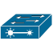
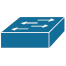
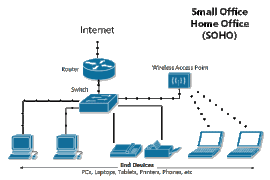

# Basic design of a network topology for a small office setup.

Step 1. Connect to the Internet

  
  
<em>Figure 1: Router -
  The office network connects to the Internet via an ISP-provided connection. This connection is linked to the router</em>

  

     What does it do? 
    
    * Acts as the gateway between the internal network and the external Internet.

    * Translates private IP addresses used within the office network into a single public IP address assigned by the Internet Service Provider (ISP).

---

Step 2. Router to Firewall

  
  
<em>Figure 2: Firewall - The router (Figure 1) connects to the firewall (Figure 2). The firewall controls access to and from the Internet, providing a layer of security. </em>

     What does it do? 
    
    * Enhances security by controlling and monitoring incoming and outgoing network traffic. It sits between the router and the core switch.

---

Step 3. Firewall to Core Switch

  
<em>Figure 3: Core Switch - The firewall (Figure 2) connects to the core switch (Figure 3). The core switch acts as the main distribution point for the network. </em>

     What does it do? 
    
    * The central hub of the network. Responsible for connecting all different parts of the network together, ensuring efficient data transfer.

---

Step 4. Core Switch to Access Switches

  
  
<em>Figure 4: Access Switch - The core switch (Figure 3) connects to multiple access switches. These access switches handle the distribution of network connections to end devices within the office. </em>

     What does it do? 
    
    * Connects devices within the office, providing scalability. Multiple access switches provide redundancy and improve network performance.

---

Step 5. Access Switches to Workstations

  
  
<em>Each access switch connects to multiple workstations (PCs, laptops, etc). These connections allow workstations to communicate with each other and access network resources and the Internet. </em>

     What does it do? 
    
    * A computer or device where users perform their daily tasks. It receive network access, allowing users to perform their tasks and access online resources.

---

Small Office Network Topology in Action

  

